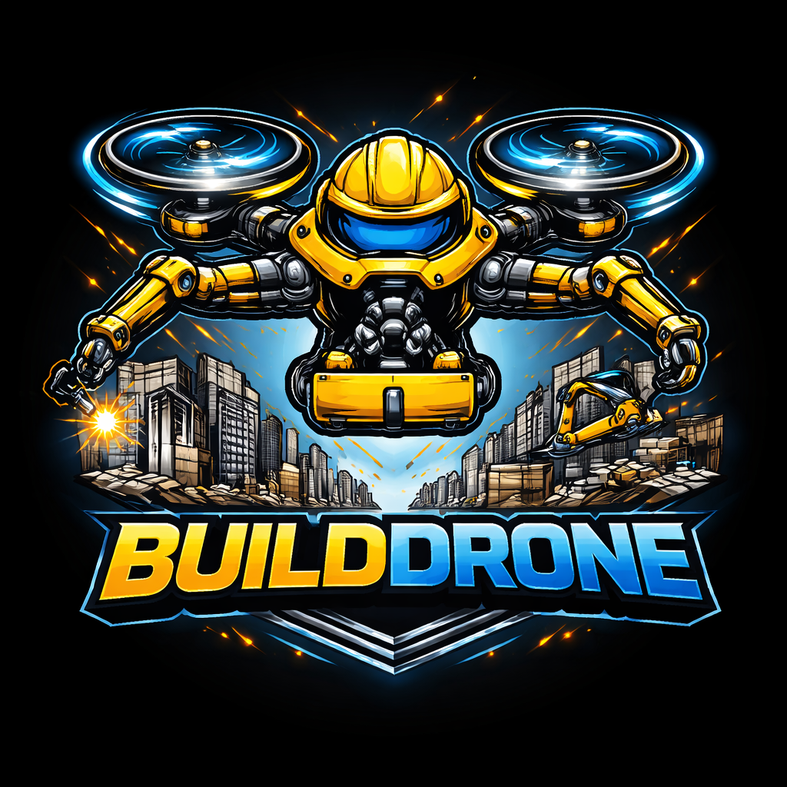

# 🚀 Builddrone



**Builddrone** is a modular, JSON-driven build orchestration framework and CLI.
It allows you to define build pipelines declaratively and execute them through pluggable modules.

> 🛠️ *"Build pipelines on autopilot."*

---

## ✨ Features

* 📦 JSON-based pipeline configuration
* 🔌 Modular architecture (implement and inject your own build modules)
* 🧠 Simple execution engine
* 🚀 Stage-based execution for an easy pipeline usage (`build`, `upload`, etc.)

---

---

## ⚙️ Example Configuration

Create a file called `build.json`:

```json
{
  "build": {
    "compile": {
      "module": "compile",
      "args": {
        "cmd": "dotnet build"
      }
    },
    "codesign": {
      "module": "codesign",
      "args": {
        "path_env": "codesign_path",
        "cmd": "codesign my_build.dll"
      }
    },
    "compress": {
      "module": "compress",
      "args": {
        "format": "zstd",
        "input": "binaries"
      }
    },
    "zip": {
      "module": "zip",
      "args": {
        "files": "my_folder"
      }
    }
  },
  "upload": {
    "artifactory": {
      "module": "artifactory",
      "args": {
        "token_env": "artifactory_token_env",
        "jfrog_path_env": "jfrog_path_env",
        "cmd": "jfrogv2.exe upload"
      }
    }
  }
}
```

---

## 🧠 How It Works

* Top-level keys (`build`, `upload`) are **stages**
* Each stage contains **steps**
* Each step maps to a **module**
* Modules receive **args** and execute logic

---

## 🧱 Using Builddrone as a Framework

You can use Builddrone programmatically:

```python
from builddrone.engine import ExecutionEngine
from builddrone.modules.compile import CompileModule
from builddrone.modules.codesign import CodesignModule
from builddrone.modules.compress import CompressModule
from builddrone.modules.zip import ZipModule
from builddrone.modules.artifactory import ArtifactoryModule

modules = {
    "compile": CompileModule(),
    "codesign": CodesignModule(),
    "compress": CompressModule(),
    "zip": ZipModule(),
    "artifactory": ArtifactoryModule()
}

engine = ExecutionEngine(modules)
engine.run("build.json", "build")
```

---

## 🧩 Creating Custom Modules

You can define your own modules:

```python
from builddrone.modules.base import BaseModule
import subprocess

class MyCustomModule(BaseModule):
    def run(self, args, context):
        subprocess.run("echo Hello from custom module", shell=True)
```

Register it:

```python
modules = {
    "custom": MyCustomModule(),
}

engine = ExecutionEngine(modules)


```

Use it in JSON:

```json
{
  "build": {
    "custom_step": {
      "module": "custom",
      "args": {}
    }
  }
}
```

---

## 🔄 Execution Flow

```
CLI → Load JSON → Select Stage → Execute Steps → Call Modules
```

---

## 📌 Design Principles

* **Explicit over magic** → modules are injected
* **Extensible** → add new modules without changing core
* **Decoupled** → config and execution are separate

---

## 🧪 Proof of Concept

This project demonstrates how a simple JSON configuration can drive a full build pipeline:

* Compile code
* Sign binaries
* Compress artifacts
* Package files
* Upload to artifact storage

---

## 📄 License

MIT License

---

## 👨‍💻 Author

Built with ❤️ using Python
